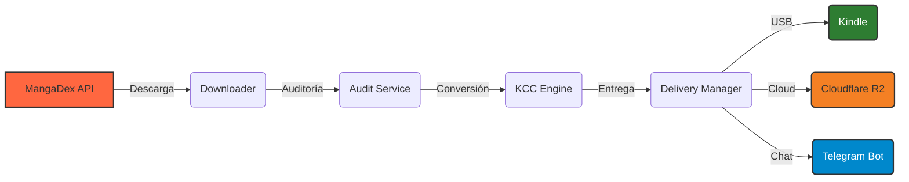

# 📖 md2kindle (MangaDex to Kindle)

[🌐 English](README.md) | **Español**

Un pipeline de automatización para descargar manga desde [MangaDex](https://mangadex.org) y convertirlo a formatos optimizados para e-readers.

> [!NOTE]
> MOBI es la salida por defecto. AZW3 puede estar disponible según la configuración de KCC.

## Inicio Rápido

1. **Instala los requisitos**: [Python 3.13](https://www.python.org/downloads/) y descarga los binarios de [kcc_c2e](https://github.com/ciromattia/kcc/releases), [mangadex-dl](https://github.com/mansuf/mangadex-downloader/releases) y [ffsend](https://github.com/timvisee/ffsend/releases) en la carpeta `bin/`.
2. **Configuración**:

   ```bash
   git clone https://github.com/LogicalReality/md2kindle.git
   cd md2kindle
   pip install -e .
   copy .env.example .env
   ```

3. **Ejecución**: Corre `run.bat` (Windows) o `python md2kindle.py`.

## Características Principales

| Función | Descripción |
| :--- | :--- |
| **Fallback Inteligente** | Intenta automáticamente `es-la` > `en` > `es` por cada capítulo. |
| **Optimizado para Kindle** | Lectura RTL, escalado de imágenes y rotación de páginas dobles. |
| **Entrega Flexible** | Telegram directo, enlaces de Cloudflare R2 o USB (Windows). |
| **Cero Configuración** | Auto-detecta binarios en `./bin/`, PATH o venv. |

## Cómo funciona

`md2kindle` opera como un pipeline orquestado:



1. **La Fuente**: Obtiene metadatos e imágenes desde MangaDex.
2. **La Forja**: Empaqueta los capítulos en CBZ y usa Kindle Comic Converter (KCC) para optimizarlos para pantallas e-ink.
3. **El Correo**: Entrega el archivo final para e-reader (`.mobi` por defecto) a tu destino preferido.

## Detalles

### Requisitos

- **Entorno**: Crea un archivo `.env` para funciones de Telegram/Cloudflare (ver `.env.example`).

### Uso de CLI

```bash
python md2kindle.py <URL> [OPCIONES]
```

- `--mode`: `v` (volumen) o `c` (capítulo).
- `--lang`: ej. `es-la`, `en`, `ja`.
- `--telegram`: Entrega directa a tu bot.
- `--r2`: Sube a Cloudflare y recibe un enlace.

## Despliegue

- **GitHub Actions**: Disparo manual desde la pestaña Actions (requiere secrets).
- **Bot de Telegram**: Despliegue serverless vía Cloudflare Workers (`.github/workers/telegram-bot.js`).

## Checklist

- [ ] Python 3.13 instalado.
- [ ] Binarios presentes en `bin/`.
- [ ] `.env` configurado (si usás funciones cloud).

---

> [!TIP]
> Para una comprensión arquitectónica más profunda, revisá [docs/UNDERSTANDING_MD2KINDLE.md](docs/UNDERSTANDING_MD2KINDLE.md) o [AGENTS.md](AGENTS.md).
