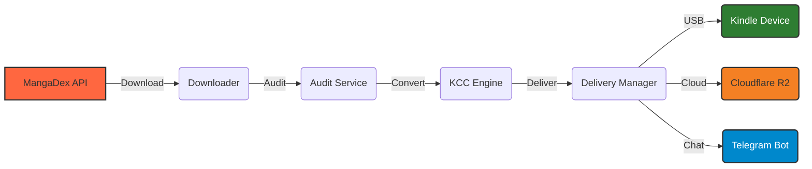

# 📖 md2kindle (MangaDex to Kindle)

**English** | [🌐 Español](README.es.md)

An automation pipeline to download manga from [MangaDex](https://mangadex.org) and convert it into e-reader-optimized formats.

> [!NOTE]
> MOBI is the default output. AZW3 may be supported depending on KCC settings.

## Quick Start

1. **Install Prerequisites**: [Python 3.13](https://www.python.org/downloads/) and download [kcc_c2e](https://github.com/ciromattia/kcc/releases), [mangadex-dl](https://github.com/mansuf/mangadex-downloader/releases), and [ffsend](https://github.com/timvisee/ffsend/releases) binaries into the `bin/` folder.
   *(ffsend is only used as a fallback for large Telegram deliveries when Cloudflare R2 is not configured)*.
2. **Setup**:

   ```bash
   git clone https://github.com/LogicalReality/md2kindle.git
   cd md2kindle
   pip install -e .
   ```

   - **Windows**: `copy .env.example .env`
   - **Linux/macOS**: `cp .env.example .env`

3. **Execute**: Run `run.bat` (Windows) or `python md2kindle.py`.

## Core Features

| Feature | Description |
| :--- | :--- |
| **Intelligent Fallback** | Automatically tries `es-la` > `en` > `es` per chapter. |
| **Kindle Optimized** | RTL reading, upscaling, and double-page spread rotation. |
| **Flexible Delivery** | Deliver via USB or Telegram (direct file, R2 links, or ffsend fallback). |
| **Zero Config** | Auto-detects binaries in `./bin/`, PATH, or venv. |

## How it Works

`md2kindle` operates as a strictly orchestrated pipeline:



1. **The Source**: Fetches metadata and images from MangaDex.
2. **The Forge**: Packages chapters as CBZ and uses Kindle Comic Converter (KCC) to optimize them for e-ink displays.
3. **The Courier**: Delivers the final e-reader file (`.mobi` by default) to your preferred destination.

## Details

### Requirements

- **Environment**: Create a `.env` file for Telegram/Cloudflare features (see `.env.example`).

### CLI Usage

```bash
python md2kindle.py <URL> [OPTIONS]
```

- `--mode`: `v` (volume) or `c` (chapter).
- `--lang`: e.g., `es-la`, `en`, `ja`.
- `--telegram`: Direct delivery to your bot.
- `--r2`: Upload to Cloudflare and receive a link.

## Deployment

- **GitHub Actions**: Manual trigger via the Actions tab (requires secrets).
- **Telegram Bot**: Serverless deployment via Cloudflare Workers (`.github/workers/telegram-bot.js`).

## Checklist

- [ ] Python 3.13 installed.
- [ ] Binaries present in `bin/`.
- [ ] `.env` configured (if using cloud features).

---

> [!TIP]
> For a deeper architectural understanding, check [docs/UNDERSTANDING_MD2KINDLE.md](docs/UNDERSTANDING_MD2KINDLE.md) or [AGENTS.md](AGENTS.md).
