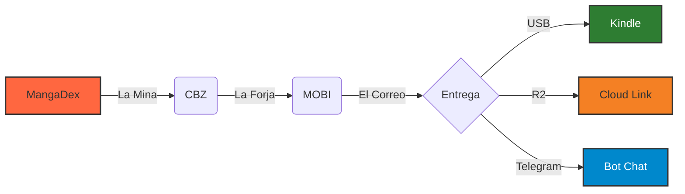

# 🧠 Entendiendo md2kindle (Guía Táctica)

Esta guía explica las complejidades del proyecto de forma sencilla. Si te perdés entre tanto código, este es tu mapa.

## El Gran Flujo (El Pipeline) 🎼

`md2kindle` no es un solo script, es una **fábrica**. Todo pasa por `app/pipeline.py`, que coordina el proceso:

| Estación | Archivo Responsable | ¿Qué hace? |
| :--- | :--- | :--- |
| **1. La Mina** | `services/mangadex/downloader.py` | Busca el manga, gestiona idiomas y descarga imágenes en `.cbz`. |
| **2. La Forja** | `services/converter/engine.py` | Llama a KCC para transformar fotos en un libro que el Kindle entienda. |
| **3. El Correo** | `services/delivery/manager.py` | Decide si el archivo va por Telegram, R2 o ffsend según el tamaño. |

## El Cerebro: `AppConfig` ⚙️

Para que la fábrica funcione, necesita instrucciones claras. Todo vive en el objeto `AppConfig` (en `core/config/settings.py`):

- **Inyectable**: Podemos crear una configuración "de mentira" para tests sin romper la real.
- **Inmutable**: Una vez que arranca, no se cambia nada a mitad de camino.
- **Auto-Detección**: Sabe si estás en GitHub Actions (CI) o en tu PC y ajusta los logs y rutas solo.

## Resolución de Binarios 🔍

El script necesita herramientas externas (`mangadex-dl`, `kcc`). Las busca en este orden:

1. **Local**: Carpeta `./bin/` (Prioridad máxima).
2. **Sistema**: PATH del Sistema Operativo.
3. **Venv**: Si se instalaron vía pip.

> [!TIP]
> Si hay varias versiones (ej: `kcc_9.6.exe` y `kcc_10.1.exe`), el script siempre elige la **más nueva** automáticamente.

## Granular Fallback (Idiomas) 🌐

MangaDex es un caos. A veces el capítulo 1 está en español, pero el 2 solo en inglés. El script hace esto:

1. El usuario pide `es-la`.
2. El script revisa capítulo por capítulo.
3. ¿Falta el cap en `es-la`? Lo busca en `en` (Inglés). ¿Sigue faltando? Lo busca en `es` (España).
4. Al final, te entrega el tomo mezclando idiomas si es necesario para que no te falte nada.

## ¿Dónde toco si quiero...? 🛠️

| Objetivo | Archivo / Carpeta |
| :--- | :--- |
| **Cambiar calidad/formato del MOBI** | `core/config/settings.py` (`KCC_PROFILE`) |
| **Agregar un nuevo método de envío** | `services/delivery/` (y registrarlo en `manager.py`) |
| **Mejorar la lógica de descarga** | `services/mangadex/downloader.py` |
| **Arreglar un error en el CLI** | `app/cli.py` |

---

> [!IMPORTANT]
> **Resumen para humanos**: El código está diseñado para que el **qué hacer** (Pipeline) esté separado del **cómo se hace** (Infrastructure) y del **con qué datos** (Models).
